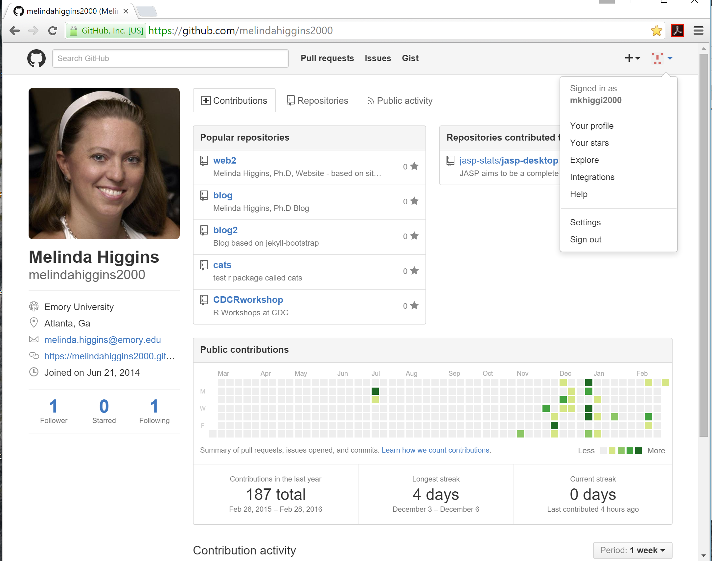

```{r setup, include=FALSE}
knitr::opts_chunk$set(echo = FALSE)
```

##  What is GIT??

**GIT** is a widely used source code management system for software development. It was designed and developed in 2005 by Linux kernel developers (e.g. Linus Torvalds) for Linux kernel development. 

**GIT** is a distributed version control system with complete history & version-tracking capabilities. [Other version control systems you may have heard of are Subversion, CVS, Perforce, and ClearCase] 

**GIT** is FREE & distributed under the terms of the GNU General Public License version 2. More @  [https://git-scm.com/](https://git-scm.com/)

##  What is Github??

**Github** is web-based **GIT** repository hosting service. It offers all of the distributed revision control and source code management (SCM) functionality of Git as well as adding its own features - for example, native interpretation of [*markdown*](https://daringfireball.net/projects/markdown/) which is MUCH easier to code/write than HTML - very lightweight code for creating documents.

**Github**, unlike Git, which is strictly a command-line tool, GitHub provides a Web-based graphical interface and desktop as well as mobile integration. **Github** provides access control and collaboration features such as bug tracking, feature requests, task management, and wikis for every project.

## Setup a Github Account

Setup a Github account at [https://github.com/](https://github.com/). Choose a username, enter your email and a password.


## Choose the FREE option


## Congrats - you now have a Github Account

From here you can create a new repository, setup your profile and more...


## Creating my CDCRWorkshop Repository

*NOTE: The 1st time, I suggest initializing with a README file...*


## Simple New Repository

*Note the "Download ZIP" and "Fork" buttons...*


## Multiple Ways to Get a Repository

* Download the repository as a **ZIP**ped file
    + simple and fast
    + need to download again if/when changes occur to original
    
* Fork an existing repository to your own Guthub account
    + allows you to stay current
    + if you make changes, you can suggest those changes to the original author who can accept or reject
    
* Download the **Github** Desktop Client
    + Download at [https://desktop.github.com/](https://desktop.github.com/)
    + use client to create or clone a repository
    + easy to stay synched between local computer/system and Github repository(ies)

## Finding a Repository

Search for a Repository or Author's site



## Forking a Repository

Go to repository, click "FORK"


## Fork Repository to Your Github Account

*Processing...*


## Your "Forked" Copy of the Repository


## Your forked copy on your Github profile page


## Your forked copy on your Github home page


## Submit "PULL" request and update your copy as needed


## Merge pull request

*This should work if you haven't made changes...*


## Merged OK


## Github Client - Clone Your Repository


## Save on your local computer/system


## In Process...


## Clone successful


## SHA (Secure Hash Algorithm) Code

*Note the "SHA" code*  

The SHA code is used to explicitly ID the repository version (snapshot) - example in Github client


## SHA code in Github


## Local files after "cloning"


